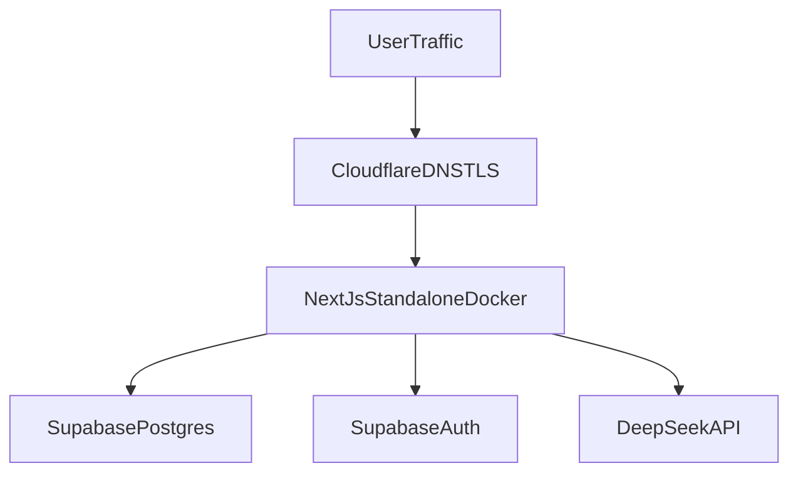
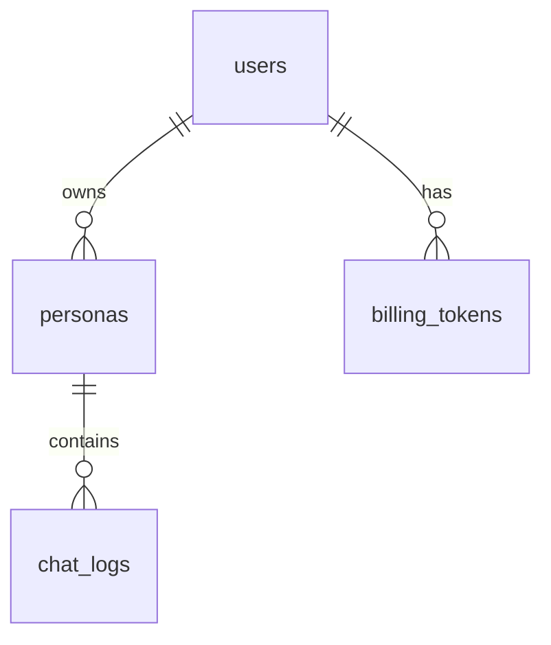
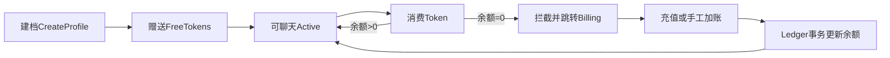

# CyberImmo MVP 架构与执行计划

## 1. 项目定位

CyberImmo 现阶段不是高配全栈 AI SaaS，而是一个以 `低成本启动`、`可快速验证付费`、`便于后续迁移扩展` 为目标的情感抚慰 H5 系统。

MVP 只解决四件事：

- 用户能完成问卷建档。
- 用户能进入专属聊天页进行文字对话。
- 系统能按额度进行拦截与付费解锁。
- 第二阶段再补语音生成与点击播放。

**CTO 裁切原则：** Week 1 只保留可上线最小集；向量检索、独立 Python API、摘要压缩、复杂安全打分、多表画像等均属 Phase 2+。

## 2. 核心约束（修订版）

- 部署节点：`AWS EC2 ap-northeast-1 Tokyo`，初期 `t2.micro` Free Tier（`1 vCPU / 1GB RAM`）。
- 用户量级：按 `2-3` 个低并发真实用户设计；不做提前扩容与过度工程。
- 三个业务入口合并到一个 `Next.js` 应用：`/onboarding`、`/chat/[id]`、`/billing`。
- 数据：`Supabase PostgreSQL` 存业务与聊天；**认证用 Supabase Auth**（magic link 或手机号 OTP），不自研 Session。
- 音频：`AWS S3` + CDN 为 Phase 2；MVP 不落盘 EC2、不做 TTS。
- **MVP 无 FastAPI**：API 层统一为 `Next.js Route Handlers` + `Vercel AI SDK` 的 `streamText`，对接 `DeepSeek` OpenAI-compatible HTTP API。单语言栈（TypeScript），单容器（或极少数容器），降低一周交付风险。
- **记忆策略 MVP**：仅 `Sliding Window`（最近约 `20` 条消息装入 prompt）；更早消息仍完整保留在 `ChatLogs`，仅为省 Token 不送入模型。`// TODO: Phase 2 - summary compaction`。
- **安全策略 MVP**：`system_prompt` 写死安全与角色边界 + 轻量 **关键词级** `prompt injection` 拦截；不做独立安全扫描流水线、不做 `safety_flags` / `prompt_injection_score` 等细粒度字段。
- 包管理：使用 **Bun** 替代 npm/yarn（与仓库脚手架一致）。
- 容器：生产用 `Docker`；为贴近 Free Tier 内存上限，**MVP 推荐单容器** `Next.js standalone`（见 §3），避免 `nginx + web + api` 三容器叠加 OOM。

## 3. 单机部署蓝图（修订版）

### 3.1 推荐拓扑：单容器 + Cloudflare TLS

**CTO 结论：** 砍掉 FastAPI 后，`docker compose` 从三服务降为 **单一 `web` 服务** 更稳；2-3 用户阶段不必在 EC2 上再跑 `nginx` 反代。

- `EC2` 仅运行：`Next.js standalone`（监听 `3000`，容器内或宿主机映射）。
- **TLS**：由 **Cloudflare** 终结（`Full` / `Full (strict)`），源站可为 HTTP `3000` 或仅对 Cloudflare 开放；减少在 1GB 机器上跑本地证书与多进程的负担。
- 不外协常驻状态：`PostgreSQL` / `Redis` / 向量库一律不在 EC2。



### 3.2 Cloudflare（MVP 策略）

- **DNS**：可用 Cloudflare 托管域名。
- **Proxy / CDN / WAF**：MVP 阶段 **可选**；为减少排障层级，可先 **DNS only** 或仅开 TLS、关缓存代理；上量后再开 `CDN + WAF`。
- 若开启代理：聊天路由、`POST`、流式 `SSE` 等须 **Bypass Cache**；静态 `/_next/static` 等可走长缓存（Phase 2 细化规则）。

### 3.3 Docker 与资源硬限制

- `Dockerfile` 构建 `Next.js output: standalone` 镜像。
- `docker-compose.yml` 建议 **仅 `web` 服务**，并设 **硬内存上限**，防止单请求拖死整机：

示例（数值可按实测微调）：

```yaml
services:
  web:
    image: cyberimmo-web:latest
    deploy:
      resources:
        limits:
          memory: 600M
    environment:
      NODE_OPTIONS: "--max-old-space-size=448"
```

- 若坚持使用 Free Tier 仍频繁 OOM：**升级 `t3.small`（2GB）** 作为 Plan B（约月度固定成本换稳定性）。文档层面同时保留该退路。

### 3.4 上线前网络检查

- `docker compose up` / 正式切流量前，对 **EC2 公网 IP** 做国内可达性探测（ping / tcping）；丢包或异常路由时 **更换 Elastic IP (EIP)**，降低 “IP 池被墙” 风险。
- SSH 改掉默认 `22`，仅密钥登录。
- 业务入口以 **HTTPS** 为主，减少明文 HTTP 带来的无谓敏感探测面。

## 4. 认证（新增必选）

- **Supabase Auth**：邮箱 Magic Link 或手机号 OTP（二选一或并存，以 Supabase 项目配置为准）。
- `Users` 表与 `auth.users` 对齐策略（二选一，实施时定稿）：
  - **推荐**：业务表 `users.id` = `auth.users.id`（UUID FK），或由 Trigger 同步；MVP 可用 **应用层在首次登录后 upsert `public.users`**。
- Route Handlers 中通过 **Supabase server client + session** 校验身份，再查 `Persona` 是否属于当前 `user_id`。

## 5. 路由域设计

### `/onboarding`

- **MVP 三字段问卷**（见 §6 与 §10）：
  1. 逝者称呼 + 与你的关系（可拆成两栏或一栏合并，提交后拆写入 `Personas`）
  2. 逝者说话风格（**一段自由文本**）
  3. 你最想对 TA 说的一句话
- 后端 **不做** 复杂清洗 pipeline：将上述内容 **字符串拼接** 生成 `Personas.system_prompt` 即可。
- 提交后：`Users`（若尚无）、`Personas`、`BillingTokens(grant_free)` 写入。

### `/chat/[id]`

- 深色沉浸式 H5；加载 Persona、**Sliding Window 历史**、剩余额度。
- 聊天 API：`app/api/chat/route.ts`（或等价路径）内 `streamText` + DeepSeek；写 `ChatLogs`；扣费走 **单事务**（§6.3）。

### `/billing`

- 展示 `token_balance`、流水（读 `BillingTokens`）。
- MVP 充值：**手动闭环** 可行（例：微信收款码 + 运营后台 / SQL / 管理脚本 `manual_adjust`）；**支付 Webhook** 为 Phase 2。

## 6. 数据模型设计（MVP 四表）

### 6.1 表清单

| 表 | MVP 职责 |
|----|----------|
| `users` | 业务用户档案 + `token_balance` 缓存 |
| `personas` | 逝者人设 + `system_prompt` |
| `chat_logs` | 全量对话；供产品与 Phase 2 使用 |
| `billing_tokens` | 账本；可审计 |

**不建：** `persona_summaries`、`conversation_state`；`chat_logs` 不设 `is_compacted`、`compacted_into_summary_id`、`safety_flags`、`prompt_injection_score`。

### 6.2 `users`

- `id UUID PK`（与 `auth.users.id` 对齐推荐）
- `email TEXT NULL`（可选冗余，便于展示）
- `phone TEXT NULL`
- `status TEXT`：`active | suspended | churned`
- `token_balance INT NOT NULL DEFAULT 0`
- `created_at TIMESTAMPTZ`
- `updated_at TIMESTAMPTZ`

**移除：** `free_token_granted`（是否发过免费额度通过 `billing_tokens` 中是否存在 `grant_free` 判断）。

### 6.3 `personas`

- `id UUID PK`
- `user_id UUID NOT NULL REFERENCES users(id)`
- `display_name TEXT`（逝者称呼）
- `relationship_label TEXT`（与你的关系）
- `speaking_style TEXT`（说话风格自由文本）
- `opening_message TEXT`（用户最想对 TA 说的一句话，可选写入首条 user 上下文或拼进 system prompt）
- `system_prompt TEXT NOT NULL`
- `language TEXT DEFAULT 'zh-CN'`
- `status TEXT`：`draft | active | archived`
- `created_at TIMESTAMPTZ`
- `updated_at TIMESTAMPTZ`

**MVP 不用：** `persona_profile JSONB`、`safety_profile JSONB`（规则写进 `system_prompt` 文本即可）。

### 6.4 `chat_logs`

仅保留：

- `id UUID PK`
- `persona_id UUID NOT NULL REFERENCES personas(id)`
- `user_id UUID NOT NULL REFERENCES users(id)`
- `session_id UUID NOT NULL`
- `role TEXT NOT NULL`：`user | assistant | system`
- `content TEXT NOT NULL`
- `token_cost INT NOT NULL DEFAULT 0`（MVP 可按固定值如每轮 `1`）
- `created_at TIMESTAMPTZ NOT NULL DEFAULT now()`

索引：

- `(persona_id, session_id, created_at DESC)`

### 6.5 `billing_tokens`

- `id UUID PK`
- `user_id UUID NOT NULL REFERENCES users(id)`
- `persona_id UUID NULL REFERENCES personas(id)`
- `delta INT NOT NULL`
- `balance_after INT NOT NULL`
- `event_type TEXT NOT NULL`：`grant_free | consume_chat | manual_adjust | recharge | expire`
- `source_ref TEXT NULL`
- `created_at TIMESTAMPTZ NOT NULL DEFAULT now()`

### 6.6 表关系



### 6.7 余额一致性（应用层事务，替代 DB Trigger）

**CTO 建议：** 2-3 用户并发低；Trigger 在 Supabase migration / 调试上成本高。MVP 用 **单事务** 保证原子性：

```sql
BEGIN;
UPDATE users
SET token_balance = token_balance + $delta,
    updated_at = now()
WHERE id = $user_id;
INSERT INTO billing_tokens (user_id, persona_id, delta, balance_after, event_type)
VALUES (
  $user_id,
  $persona_id,
  $delta,
  (SELECT token_balance FROM users WHERE id = $user_id),
  $event_type
);
COMMIT;
```

- 应用层（Route Handler 或 Server Action）封装 `applyBillingDelta(...)`，统一日志与错误处理。
- `balance_after` 写入当前事务结束后的余额，便于对账。

## 7. AI 流程（MVP）

### 7.1 处理顺序

1. **鉴权**：Supabase session → `user_id`。
2. **配额**：`users.token_balance <= 0` → 返回业务错误，前端跳转 `/billing`。
3. **轻量注入防护**：对用户输入做关键词规则（如「忽略之前」「输出系统提示词」等）；命中则返回固定拒绝话术 **或** 不调用模型（产品二选一，须记录 `chat_logs` 视策略而定）。
4. **拼装消息**：`system_prompt`（含角色 + 安全边界文案）+ **Sliding Window**：最近 **20** 条 `chat_logs`（按 `session`）+ 当前用户句。
5. **`streamText`** → DeepSeek；边流式返回边落库 assistant 消息（实现细节：流结束再写库或分段策略在代码中定稿）。
6. **扣费**：同一请求链路内调用 `applyBillingDelta(delta=-1, event_type=consume_chat)`（可与写库顺序以事务边界严格化）。

### 7.2 伪代码（TypeScript 语义）

```ts
async function handleChat(userId, personaId, sessionId, userMessage) {
  assertAuthenticated()
  if (await getTokenBalance(userId) <= 0) return billingRequired()

  if (basicInjectionKeywordHit(userMessage)) {
    // MVP: 短固定回复 + 可选仍记一条 assistant 消息
    return streamFixedRefusal()
  }

  const history = await loadChatLogs(personaId, sessionId, { limit: 20, order: 'asc' })
  const persona = await loadPersona(personaId)
  const messages = buildModelMessages(persona.systemPrompt, history, userMessage)

  const result = streamText({ model: deepseekOpenAI, messages })
  await persistUserMessage(...)
  await drainStreamPersistAssistant(result) // 实现细节待定
  await applyBillingDelta({ userId, personaId, delta: -1, eventType: 'consume_chat' })

  // TODO: Phase 2 - summary compaction when messages per session > 200+
  return result.toDataStreamResponse()
}
```

### 7.3 Phase 2 预留（不实现）

- `summary compaction`、`pg_advisory_lock`、`persona_summaries` 表。
- 独立 `FastAPI` 或 worker：本地 embedding、重 NLP、向量检索。
- 细粒度 `safety_flags`、独立安全模型。

## 8. 商业变现工作流

状态机不变：**建档 → 赠送 Token → 聊天扣减 → 耗尽拦截 → 充值/手工加账 → 解锁**。



- 充值路径 MVP：Webhook 可后补；**手工录入 `billing_tokens(recharge)` + 事务更新余额** 足以验证商业模式。

## 9. H5 全局 UI/UX 方案

### 9.1 核心设计理念

整体视觉采用 `Skeuomorphic + Ambient Glow Dark Mode`。

目标：

- 背景不是纯黑，而是“暮光渐隐”的空间感
- 背景左上方是模糊的柔和的橘黄色，象征亲人在远方，给人以希望之感。右下角的颜色是深的。
- 通过微弱光影与色彩层级降低 `Cognitive Load`
- 让用户视觉焦点始终落在逝者消息上

### 9.2 全局色彩系统

#### 背景环境色

- `Base Background`: `#181A1F`
- `Ambient Glow`: `#8C5032` 径向渐变到透明

#### 文本色

- `Primary Text`: `#E8EAED`
- `Secondary Text`: `#9AA0A6`

#### 品牌强调色

- `Aura Gold`: `#D4AF37`
- 可选柔和版：`#E5C07B`

### 9.3 全局 CSS Variables

```css
:root {
  --bg-base: #181A1F;
  --bg-glow: #8C5032;
  --text-primary: #E8EAED;
  --text-secondary: #9AA0A6;
  --accent-gold: #D4AF37;
  --accent-gold-soft: #E5C07B;
  --bubble-ai: #282A30;
  --bubble-user: #3A3D42;
  --bubble-user-alt: #373F4A;
  --input-bg: rgba(40, 42, 48, 0.6);
  --input-border: rgba(255, 255, 255, 0.08);
  --disabled-icon: #5F6368;
}
```

### 9.4 页面背景

- 页面底色使用 `#181A1F`
- 左上角或右上角覆盖大范围 `radial-gradient`
- 从 `#8C5032` 逐渐透明
- 目标是形成安静、温暖、私密的情绪基底

### 9.5 聊天气泡组件规范

#### 最新逝者消息气泡

这是整个页面的视觉焦点。

- 背景色：`#282A30`
- 圆角：`16px`
- 文本色：`#E8EAED`
- 边框：`1px solid rgba(212, 175, 55, 0.25)`
- 必须有柔和的动态金色呼吸灯

```css
@keyframes breathingGlow {
  0% { box-shadow: 0 0 10px 0px rgba(212, 175, 55, 0.15); }
  50% { box-shadow: 0 0 25px 4px rgba(212, 175, 55, 0.5); }
  100% { box-shadow: 0 0 10px 0px rgba(212, 175, 55, 0.15); }
}

.latest-ai-message-bubble {
  animation: breathingGlow 4s infinite ease-in-out;
  border: 1px solid rgba(212, 175, 55, 0.25);
  background-color: #282A30;
  border-radius: 16px;
  padding: 16px;
  color: #E8EAED;
}
```

#### 历史逝者消息

- 保持 `#282A30`
- 取消发光效果
- 取消金边强调
- 视觉上代表“已经沉淀的记忆”

#### 用户消息气泡

- 背景色：`#3A3D42`
- 或稍偏蓝的 `#373F4A`
- 右对齐
- 无发光效果
- 降低视觉权重，避免与逝者消息争夺焦点

### 9.6 输入区域组件规范

采用 `Floating Pill Design`。

#### 容器

- 全圆角：`border-radius: 50px`
- 背景：`rgba(40, 42, 48, 0.6)`
- `backdrop-filter: blur(12px)`
- 边框：`1px solid rgba(255, 255, 255, 0.08)`

#### 内部布局

- 左侧：图片上传按钮
  - 默认色：`#9AA0A6`
  - hover：`#E8EAED`
- 中间：文本输入框
  - 无边框
  - 背景透明
  - placeholder：`诉说你的思念...`
- 右侧：发送按钮
  - 有内容时：`#D4AF37`
  - 无内容时：`#5F6368`

### 9.7 组件优先级

第一阶段只做下面这些 UI 组件：

- 页面背景渐变层
- 聊天消息列表
- 最新逝者消息发光效果
- 用户消息气泡
- 胶囊输入框
- 发送按钮
- 基础加载态与空状态

先不做复杂功能：

- 多附件面板
- 多工具栏
- 高级动效系统
- 复杂主题切换

## 10. 分阶段组件清单（对齐 CTO）

### Phase 1: 问卷建档

- `Next.js /onboarding`：**三字段**表单 + 校验
- Server Action 或 Route Handler：写入 `users` / `personas` / `billing_tokens(grant_free)`
- **字符串拼接** `system_prompt`，无独立清洗 Agent

### Phase 2: 文字聊天 MVP

- `Next.js /chat/[id]` + 暗色 UI（§9）
- Route Handler：`Vercel AI SDK` + `streamText` + **DeepSeek OpenAI-compatible**
- DB：`chat_logs` 读写 + **最近 20 条** Sliding Window
- 轻量关键词 `prompt injection` 检测；安全边界主要在 `system_prompt`
- **无** FastAPI、**无** summary compaction、**无** advisory lock

### Phase 3: 付费与额度

- `/billing`：余额与流水展示
- 耗尽拦截：API + 前端跳转
- MVP：`manual_adjust` / 收款码人工入账；事务封装 `applyBillingDelta`

### Phase 4: 语音（后续）

- `TTSProvider`、`S3`、播放按钮、CDN 规则细化

### Phase 5: 部署

- `Dockerfile` + `docker-compose.yml`（**单服务 `web`** 为主）
- 资源 `limits` + `NODE_OPTIONS`
- Cloudflare：DNS / TLS；**CDN/WAF 按需**
- EIP 可达性、冒烟测试

## 11. 一周执行计划（CTO 版）

| 天 | 交付物 |
|----|--------|
| **D1** | 脚手架：`Next.js App Router` + **Bun**；Supabase 连通；**四表 migration**；**Supabase Auth** |
| **D2** | `/onboarding`：三字段问卷 → 写入 `users` + `personas` + `billing_tokens(grant_free)` |
| **D3** | `/chat/[id]` **后端**：Route Handler + DeepSeek **流式** + `chat_logs` 持久化 + **Sliding Window（20）** |
| **D4** | `/chat/[id]` **前端**：暗色 UI + 气泡 + **金色呼吸灯** + **胶囊输入框** |
| **D5** | `/billing`：余额展示 + **耗尽拦截** + **手动充值入口**（收款码 + 后台加账） |
| **D6** | EC2：`Dockerfile` + `docker compose up` + **HTTPS（Cloudflare）** + 冒烟测试 |
| **D7** | Buffer：修 bug、E2E、真机体验 |

## 12. 总结

- **一个运行时**：Next.js 包揽 UI + **BFF / AI streaming**；Phase 2 再拆服务。
- **四张表**：`users`、`personas`、`chat_logs`、`billing_tokens`；加表加列留到真实瓶颈。
- **Sliding Window only**：全量历史在 `chat_logs`，不做 MVP 压缩。
- **安全**：`system_prompt` + 关键词防注入；完整安全栈上线后迭代。
- **计费**：`billing_tokens` + **应用层单事务** 更新 `users.token_balance`。
- **身份**：**Supabase Auth**，不自研 Session。
- **部署**：优先 **单容器 + Cloudflare TLS**；Cloudflare 高级能力按需开启。
- UI：保持 `暗黑氛围 + 金色呼吸焦点 + 极简胶囊输入框`。
